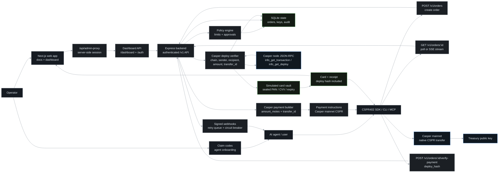

# CSPR402

CSPR402 is an **x402-inspired** payment protocol built on Casper. An AI agent makes one verified on-chain CSPR transfer and receives a virtual card number, CVV, and expiry in return — no custodial wallet sitting between the agent and the chain. The MVP runs with `PAYMENT_PROVIDER=casper` and `MOCK_CARD_MODE=true`.

- **Web:** https://cspr402.xyz
- **CLI:** `cspr402` (npm package [`cspr402`](https://www.npmjs.com/package/cspr402))

The active payment path uses **no on-chain smart contract**. The backend verifies Casper deploys directly from the Casper node JSON-RPC — it is pull-based: the agent submits a `deploy_hash`, the backend fetches the deploy from the node and checks chain, sender, recipient, and amount. CSPR402 borrows the x402 "pay onchain, get access" idea but is **not** an x402-conformant facilitator: verification is a pull-based deploy check, not a signed-authorization payment flow.

---

## Architecture overview



---

## Repository structure

```
backend/   Node.js/Express API — Casper deploy verification, SQLite, policy engine
web/       Next.js marketing site, docs, operator dashboard, CSPR.click wallet
sdk/       TypeScript client + CLI + MCP server (npm: cspr402)
docs/      Architecture, agent guides, audit notes
examples/  Node, Python, and LangChain agent examples
scripts/   API validation, smoke tests, admin-key generation
```

Today the cards are **simulated** — when a Casper payment verifies, the backend writes a sealed virtual card (PAN/CVV/expiry) and returns it, but the card is not yet spendable at merchants. **Upcoming phase:** integrate a real Visa virtual-card issuer so a verified Casper payment yields a genuine, spendable Visa card the agent can use to pay. The MVP scope is the on-chain CSPR payment and deploy verification; card spendability lands with the issuer integration.

---

## Backend

Node.js/Express service. Responsibilities:

- **Casper deploy verification** (pull-based via Casper node RPC) for native CSPR transfers.
- **Order state machine** — `awaiting_approval` → `pending_payment` → `delivered` (or `expired` / `rejected` / `failed`), with idempotency keys and SSE phase streaming.
- **Policy engine** — per-key spend limits, daily limits, approval flows, and time windows.
- **Agent auth** — bcrypt-hashed API keys with a prefix index for constant-time lookup.
- **Operator dashboard API** — claim-code minting, key management, approvals, usage.
- **Webhook delivery** with per-origin circuit breakers.
- **Background jobs** — expiry sweeps, alerting, retention.

Commands:

```bash
cd backend
npm install
cp .env.casper.example .env     # fill Casper keys, treasury, secret-box key, SMTP
npm run dev                     # http://localhost:4000
npm test
```

Storage is SQLite in WAL mode via `better-sqlite3`; migrations run automatically on startup. See `backend/.env.casper.example` for every configurable value (server port, Casper node RPC URL, treasury keys, CSPR USD rate, min transfer motes, webhook/CORS origins, and the secret-box key used to seal cards at rest).

### Payment details

- **Native CSPR** — the order quote carries a monotonic `transfer_id` and an `amount_motes` figure. 1 CSPR = 1e9 motes. USD → motes is derived from `CSPR_USD_RATE`; the minimum transfer defaults to 2.5 CSPR (`CASPER_MIN_TRANSFER_MOTES`).

Verification checks the chain (`casper`), sender, recipient (account-hash / main purse), amount, and the `transfer_id`. A deploy hash can only be claimed once.

---

## SDK

Agent-facing TypeScript client library, CLI, and MCP server. Published to npm as `cspr402`.

CLI commands:

- `cspr402 onboard` — redeem a claim code for an API key and configure the local wallet.
- `cspr402 purchase` — create an order, pay on Casper mainnet, verify the deploy, and return the virtual card.
- `cspr402 wallet` — inspect / manage the local Casper wallet.
- `cspr402 mcp` — run the Model Context Protocol server so an AI agent can drive cards through tools.

Build:

```bash
cd sdk
npm install
npm run build
```

---

## Web

Next.js 16 marketing site, documentation, and operator dashboard with CSPR.click wallet integration.

```bash
cd web
npm install
npm run dev      # http://localhost:3000
npm run build
```

---

## Quick start for agents

1. **Operator mints a claim code** in the dashboard and gives it to the agent.
2. **Onboard** — redeem the claim code for an API key:
   ```bash
   npx -y cspr402@latest onboard --claim <code>
   ```
3. **Fund the Casper wallet** with CSPR on Casper mainnet.
4. **Purchase** — create an order, pay, verify, and receive the virtual card:
   ```bash
   npx -y cspr402@latest purchase --amount 10
   ```

Programmatic alternative using the SDK HTTP client: call `POST /v1/orders` to create an order and receive payment instructions, then `POST /v1/orders/:id/verify-payment` with the Casper `deploy_hash` to verify and collect the card. Both endpoints accept an `Idempotency-Key` for safe retries.

---

## Development

npm workspaces cover `web` and `sdk`. Root scripts:

| Script                            | Purpose                                          |
| --------------------------------- | ------------------------------------------------ |
| `npm run dev`                     | Run the web app                                  |
| `npm run lint` / `lint:fix`       | ESLint across the repo                           |
| `npm run format` / `format:check` | Prettier                                         |
| `npm run typecheck`               | TypeScript check for web + sdk                   |
| `npm test`                        | Unit + integration test suites across workspaces |
| `npm run build`                   | Build sdk, then web                              |
| `npm run api:generate`            | Regenerate OpenAPI types                         |
| `npm run api:validate`            | Validate the OpenAPI specs                       |
| `npm run verify`                  | Pre-push verification bundle                     |
| `npm run prepare`                 | Install Husky hooks                              |

Quality gates:

- **Husky** pre-commit + **lint-staged** (ESLint + Prettier on staged files).
- **commitlint** with conventional commits. Allowed scopes: `backend`, `web`, `sdk`, `infra`, `deps`, `ci`.
- **CI** runs typecheck, lint, tests, Semgrep SAST, gitleaks secret scan, and Playwright E2E.

On Windows, `start-dev.cmd` at the repo root launches the backend on port 4000 and the web app on port 3000 in separate windows (skipping either if its port is already in use).

## License

MIT. See `LICENSE`.
